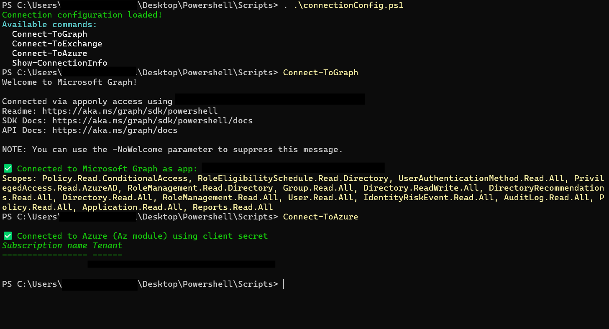
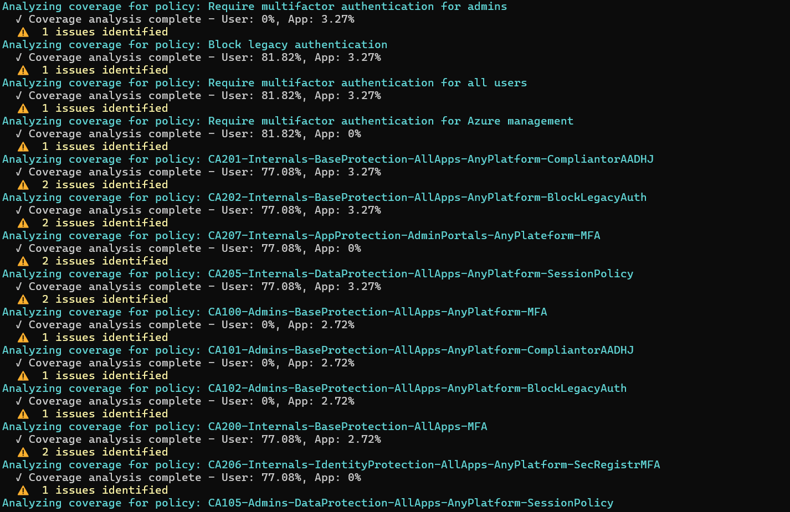
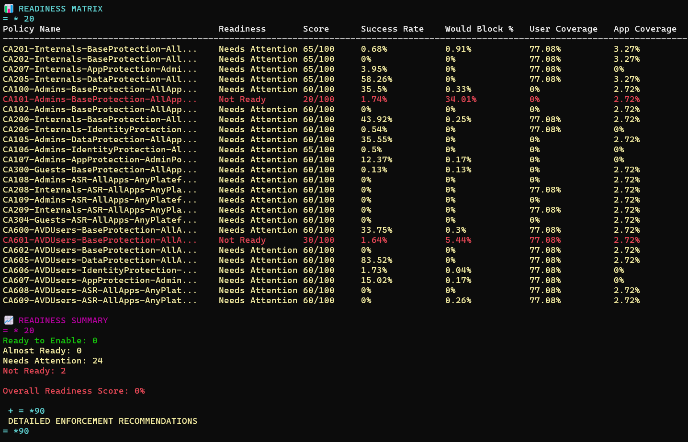
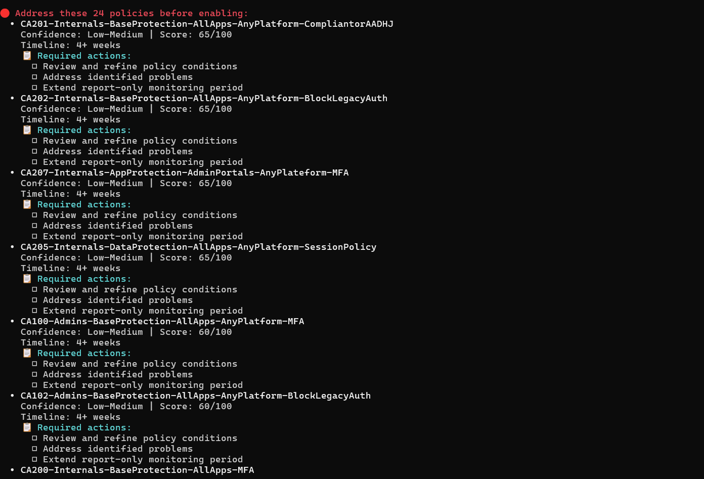

# CAP-Deployment-Analyzer
```markdown
# CAP Analyzer - Conditional Access Policy Analysis Tool

A comprehensive PowerShell tool for analyzing Microsoft Entra ID (Azure AD) Conditional Access Policies (CAPs) to assess their readiness for enforcement.

## Features

- **Definitive readiness assessment** for report-only policies
- **Clear "Ready to Enable" indicators** with confidence levels
- **Detailed sign-in log analysis** using Microsoft's conditional access evaluation results
- **Policy readiness assessment** with specific recommendations
- **Coverage gaps identification** and reporting
- **Export capabilities** to CSV for further analysis

## Prerequisites

### Required PowerShell Modules
- Microsoft.Graph.Authentication
- Microsoft.Graph.Identity.SignIns
- Microsoft.Graph.Reports
- Microsoft.Graph.Users
- Microsoft.Graph.Groups
- Microsoft.Graph.Applications

### Required Microsoft Graph Permissions
- Policy.Read.All
- AuditLog.Read.All
- Directory.Read.All
- Reports.Read.All
- User.Read.All
- Group.Read.All
- Application.Read.All

### Licensing
- Azure AD Premium P1 or P2 license (required for sign-in log access)

## Installation

1. Clone this repository:
   ```powershell
   git clone https://github.com/yourusername/CAP-Analyzer.git
   cd CAP-Analyzer
   ```

2. Install required PowerShell modules:
   ```powershell
   Install-Module Microsoft.Graph -Scope CurrentUser
   ```

## Setup

### 1. Configure ConnectionConfig.ps1

Edit `ConnectionConfig.ps1` and fill in your organization's details:

```powershell
$Global:ConnectionConfig = @{
    TenantId       = "your-tenant-id-here"  # Your Tenant ID
    ClientId       = "your-client-id-here"  # App Registration (Client ID)
    ClientSecret   = "your-client-secret-here"  # App client secret
    Organization   = "your-domain.com"      # Exchange Online domain
}
```

### 2. Run the Connection Setup

Execute these commands in PowerShell:

```powershell
# Load the connection configuration
. .\ConnectionConfig.ps1

# Connect to Microsoft Graph
Connect-ToGraph

# Verify connection (optional)
Show-ConnectionInfo
```


## Usage

### Run the CAP Analyzer

Execute the main analysis script:

```powershell
. .\cap_analyzer.ps1
```

The script will automatically:
- Test your Graph connection
- Retrieve directory objects (users, groups, applications)
- Get all Conditional Access policies
- Retrieve sign-in logs (default: last 30 days)
- Perform comprehensive analysis
- Display detailed reports

### Sample Output

The analysis will generate several reports:

1. **Enhanced Policy Report**: Detailed analysis of each report-only policy
   

2. **Problems Report**: Issues identified with policies
   

3. **Readiness Matrix**: Summary of policy readiness status
   

4. **Detailed Recommendations**: Specific recommendations for enabling policies
   

## Customization Options

### Change Sign-in Log Period

To analyze a different time period, modify the last line of `cap_analyzer.ps1`:

```powershell
# For 60 days of data instead of 30
Start-EnhancedCAPSAnalysis -SignInLogDays 60
```

### Export Results to CSV

After running the analysis, export results:

```powershell
Export-EnhancedAnalysisToCSV -OutputPath ".\My_CAPS_Analysis.csv"
```

## How the Scripts Work Together

### Authentication Flow
1. `ConnectionConfig.ps1` defines your credentials and connection functions
2. `Connect-ToGraph` uses these credentials to authenticate to Microsoft Graph
3. `cap_analyzer.ps1` uses this existing connection to access Microsoft Graph data

### Analysis Process
1. **Connection Verification**: Tests Graph connection and required permissions
2. **Data Collection**: Retrieves policies, users, groups, applications, and sign-in logs
3. **Coverage Analysis**: Determines how well policies cover targeted users/apps
4. **Impact Analysis**: Examines actual policy impact based on sign-in data
5. **Readiness Scoring**: Calculates readiness scores for report-only policies
6. **Reporting**: Generates comprehensive reports with recommendations

## Understanding the Output

### Key Reports
- **Enhanced Policy Report**: Detailed analysis of each report-only policy
- **Problems Report**: Issues identified with policies
- **Readiness Matrix**: Summary of policy readiness status
- **Detailed Recommendations**: Specific recommendations for enabling policies

### Readiness Categories
- **Ready to Enable** (Score: 85-100): High confidence that enabling won't cause issues
- **Almost Ready** (Score: 70-84): Minor issues to address before enabling
- **Needs Attention** (Score: 50-69): Significant issues requiring attention
- **Not Ready** (Score: 0-49): Major redesign needed

### Key Metrics
- **Would Be Blocked %**: Percentage of sign-ins that would be blocked if enabled
- **User/App Coverage %**: Percentage of targeted users/apps with actual sign-in activity
- **Success Rate**: Percentage of sign-ins that would succeed if enabled
- **Days in Report-Only**: How long the policy has been in report-only mode

## Troubleshooting

### Permission Errors
If you see permission errors:
1. Verify your app registration has all required Graph permissions
2. Ensure admin consent has been granted for these permissions
3. Re-run `Connect-ToGraph` after updating permissions

### No Sign-in Logs
If sign-in logs aren't retrieved:
1. Verify you have Azure AD Premium P1/P2 license
2. Check that the `AuditLog.Read.All` permission is granted
3. Try increasing the sign-in log period

### Connection Issues
If connection fails:
1. Verify your Tenant ID, Client ID, and Client Secret are correct
2. Ensure your client secret hasn't expired
3. Check that your app registration is configured correctly

## Best Practices
- **Test in Report-Only Mode**: Always test new policies in report-only mode first
- **Monitor After Enabling**: Closely monitor sign-in logs for 48 hours after enabling policies
- **Gradual Rollout**: Consider enabling policies during low-usage periods
- **Communicate Changes**: Inform users about upcoming policy changes
- **Regular Analysis**: Run this analysis regularly to monitor policy effectiveness

## Example Workflow

```powershell
# 1. Load connection configuration
. .\ConnectionConfig.ps1

# 2. Connect to services
Connect-ToGraph

# 3. Run analysis (using 45 days of data)
Start-EnhancedCAPSAnalysis -SignInLogDays 45

# 4. Export results
Export-EnhancedAnalysisToCSV -OutputPath ".\CAP_Analysis_$(Get-Date -Format 'yyyyMMdd').csv"

# 5. Review reports and implement recommendations
```

## Contributing

Contributions are welcome! Please feel free to submit a Pull Request.

## License

This project is licensed under the MIT License - see the [LICENSE](LICENSE) file for details.

## Disclaimer

This tool is provided as-is without warranty. Always test in a non-production environment first and review recommendations before implementing changes in production.

## Support

If you encounter any issues or have questions, please file an issue on this repository.
```
